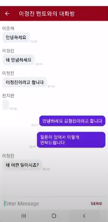
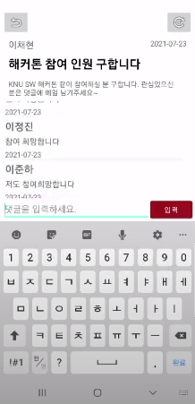

# 
작은 몸짓

------------
## 💡 프로젝트 주제
### **컴퓨터학부 선후배 간 멘토-멘티 매칭을 위한 안드로이드 플랫폼 개발**
   
   
### 📌 프로젝트 필요성
> + **COVID 19 사태의 장기화로 인한 선후배 간 연결 창구의 부족**
>> 선후배 간의 연결을 개인적인 친목에만 의존하고 있던 컴퓨터학부에서 COVID 19 사태의 장기화로 인해 선후배 간에 소통할 수 있는 기회가 크게 줄어들었다. 
>
> + **졸업생 과의 연결 네트워크 부족**
>> 취업, 창업, 대학원 진학 등 다양한 진로에 대해 졸업생들과 소통할 수 있는 방법이 컴퓨터학부 내에 존재하지 않는다. 그러다보니 졸업생들이 학부 생활에 참여하는 문화 자체가 존재하지 않았고, 자연스레 졸업과 동시에 학부로부터 멀어질 수 밖에 없는 상황이 만들어져있다.
>
> + **학부 내 소외된 인원 발생**
>> 학부가 워낙 거대하다보니 어쩔 수 없이 학부로부터 소외된 인원들이 생겨날 수 밖에 없다. 하지만 현 시점에 이러한 사람들이 학부 내에서 프로젝트 인원을 구하거나 학부 내 인적 네트워크를 구축할 방법이 크게 존재하지 않는다. 또한 이러한 문제점은 COVID 19 장기화로 인해 더욱 심화되었다.

### 🗒 프로젝트 설명
> + Andriod Studio에서 Kotlin을 이용해 Android용 애플리케이션을 개발하였다. 회원 가입 및 로그인을 통해 애플리케이션을 사용할 수 있으며, 모든 사용자는 멘토 또는 멘티로 모두 활동이 가능하다. >    
> + 데이터베이스 및 서버는 Google에서 지원하는 Firebase를 사용하였다.

### 📖 애플리케이션 기능
> + 로그인 및 이메일 인증
>> 어플리케이션 남용을 최대한 억제하기 위해 이메일 인증 기능을 구현하였다.졸업생은 일반 이메일을, 재학생은 학교 이메일을 사용하여 가입할 수 있다.
>
> + 멘토 설정
>> 모든 사용자가 멘토 및 멘티로 동시에 활동이 가능하기 때문에 프로필 화면에서 멘토 기능을 활성화 할 수 있다. 멘토 기능을 활성화하면 멘토 목록에 자신의 프로필이 나오고, 멘티가 목록에서 멘토들을 확인하여 자신이 원하는 멘토를 선택할 수 있다.     
>>      
>> 모든 사용자는 자신의 프로필에 자신의 학년, 소속 회사, 성별 등 인적 사항을 기재할 수 있다. 해당 인적 사항들은 멘토 기능을 활성화하면 이를 멘티들이 확인하여 연결을 요청할 수 있다.    
>
> + 1:1 채팅 기능
>> 멘티들이 멘토 목록에서 자신이 원하는 멘토를 선택하여 멘토의 채팅방에서 멘토와 소통할 수 있다.     
>
> + 게시판 기능
>> 꼭 멘토 멘티 매칭이 아니더라도, 프로젝트 팀원을 구하거나, 특정 질문을 하기위해 게시판을 이용할 수 있다. 게시글에는 사용자 누구나 댓글로 답변을 게시할 수 있다.
>
> + 애플리케이션 스크린 캡쳐    
>> &nbsp;&nbsp;&nbsp;&nbsp;&nbsp;&nbsp;&nbsp;&nbsp;&nbsp;&nbsp;
>> &nbsp;&nbsp;&nbsp;&nbsp;&nbsp;&nbsp;
>> &nbsp;&nbsp;&nbsp;&nbsp;&nbsp;&nbsp;

### 💊 애플리케이션 사용자
> 컴퓨터학부 재학생, 졸업생, 교수님 등 경북대학교 컴퓨터학부의 모든 구성원

### 🖱 기대효과
> + 컴퓨터학부 내 선후배 간의 소통을 촉진하여 더 끈끈한 컴퓨터학부를 만들 수 있다.    
> + 학부 내에 소외되는 인원 없이 자신이 원한다면 충분히 선후배 간 네트워크를 만들 수 있는 매개체로서의 역할을 할 수 있다.    
> + 졸업생들의 경험과 정보에 보다 쉽게 접근할 수 있으며, 졸업생들의 학부 생활 참여를 촉진할 수 있다.     
> + 컴퓨터학부의 여러 구성원들에게 학부에 대한 소속감을 고취시킬 수 있다.

### 🎥 시연영상 링크
> https://www.youtube.com/watch?v=9oLEPxwy4Og

------------
### 팀원소개
#### 이정진 (컴퓨터학부 심화컴퓨터전공 4학년)   
#### 천지완 (컴퓨터학부 심화컴퓨터전공 4학년)   
#### 이준하 (컴퓨터학부 심화컴퓨터전공 4학년)   
------------
      
      

